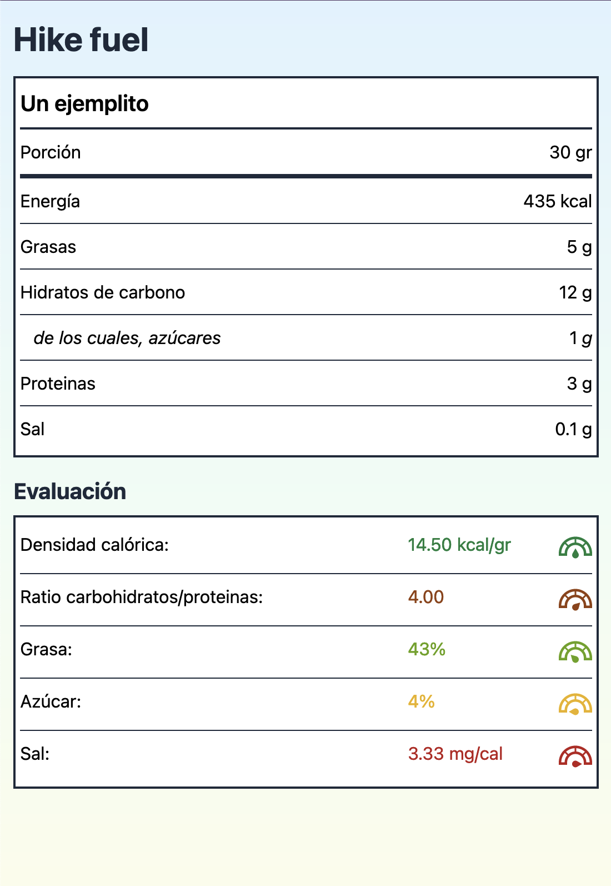

# Hike fuel

Hike fuel is a website to help hikers plan a better nutrition while on the trail.

## Functionality

Foods with high caloric density are not good enough for the trail. A correct amount of salt, fat, sugar and complex carbs is also needed. Eyeballing all of these values from the nutritional info is almost impossible, and trusting sport-oriented products is not recommended, since their composition is not always optimal. Therefore, this web.

### Roadmap

Roughly, some functionalities that I'd like to incorporate in the future would be:

- Automatically read nutritional info labels from a picture
- Evaluate two or more foods combined (for example to create custom trail mixes)
- Add a calories calculator based on trail data, to estimate the food needed.

## Development info

This project uses the following technologies:

- Remix
- Tailwind
